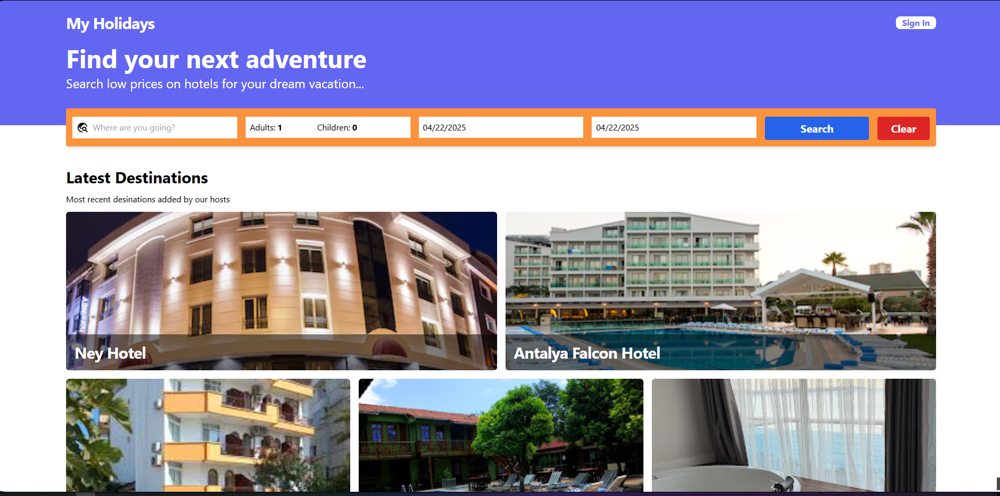
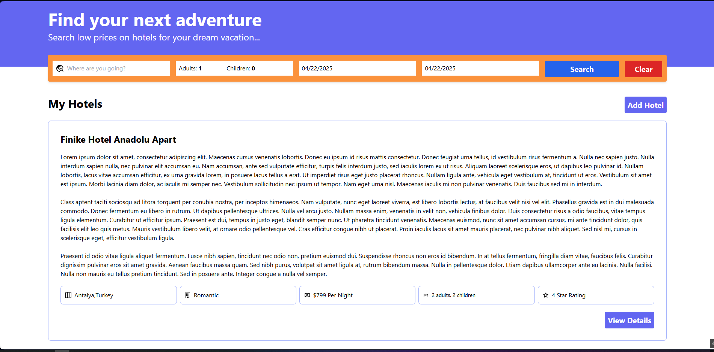
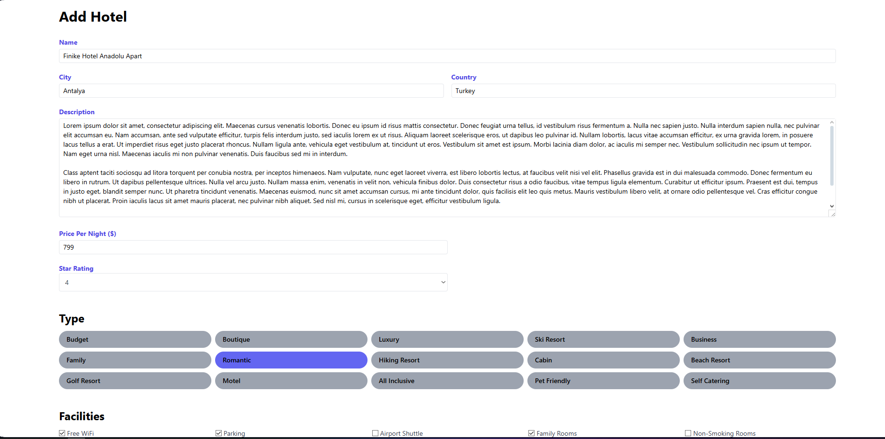

# 🏨 mern-booking-app

**mern-booking-app** is a **full-stack web application** built with the **MERN stack (MongoDB, Express, React, Node.js)** that allows users to **search and book accommodations** based on destination, number of guests, and date range. Users can **browse listings**, use **advanced filters**, and navigate with **dynamic pagination** for a smooth browsing experience.  

Authenticated users can **register, log in, create bookings**, and complete their reservations with **secure Stripe payments**. The app includes features such as **JWT-based authentication**, **Cloudinary-powered media management**, and a **responsive user interface** styled with **Tailwind CSS**.  

The platform is fully **tested end-to-end with Playwright**, ensuring both frontend and backend processes run reliably together. Whether you're booking for yourself or others, **mern-booking-app provides a modern, user-friendly, and scalable solution** for accommodation reservations.

## 🚀 Features

- 🔍 Search and filter hotels by location, number of guests (adults & children), and date range
- 🏨 View and paginate hotel listings with dynamic filtering
- 📅 Date selection via modern UI components
- 👤 User authentication for booking access
- 💳 Stripe integration for secure payments
- 🧪 End-to-end tests using Playwright
- 🎯 Responsive design with Tailwind CSS
- 🔐 JWT-based secure backend authentication

## 🧑‍💻 Tech Stack

### Backend
- Node.js / Express
- MongoDB / Mongoose
- Cloudinary (for image storage)
- express-validator
- jsonwebtoken (JWT auth)
- Stripe API (payment processing)

### Frontend
- React with TypeScript
- react-hook-form
- react-query
- react-router-dom
- react-datepicker
- Tailwind CSS

### End-to-End Testing
- Playwright

## 📸 Screenshots



 
## 🛠️ Setup Instructions

### Prerequisites
- Node.js >= 18
- MongoDB instance

### Clone the repository
```bash
git clone https://github.com/EkremL/mern-booking-app.git
cd mern-booking-app
```

### Backend Setup
```bash
cd backend
npm install
```

#### Environment Variables
Create a `.env` file inside `backend` with the following:
```env
MONGODB_CONNECTION_STRING=your_mongodb_uri
JWT_SECRET_KEY=your_secret_key
FRONTEND_URL=http://localhost:5173
CLOUDINARY_CLOUD_NAME=your_cloud_name
CLOUDINARY_API_KEY=your_api_key
CLOUDINARY_API_SECRET=your_api_secret
STRIPE_API_KEY=your_stripe_secret_key
```

For E2E testing, you can use a separate `.env.e2e` file with the same variables.

### Frontend Setup
```bash
cd frontend
npm install
```

#### Environment Variables
Create a `.env` file inside `frontend` with the following:
```env
VITE_API_BASE_URL=http://localhost:5000/api
VITE_STRIPE_PUB_KEY=your_stripe_public_key
```
## 📦 Running the Application

### Development Mode
Start both frontend and backend with:
```bash
# In root directory
npm run dev
```
This will concurrently run:
- Backend: http://localhost:5000
- Frontend: http://localhost:5173

### Running End-to-End Tests
```bash
cd backend
npm run e2e
```
This command launches the Playwright test suite.


## 📸 Application Flow
1. Users can search for destinations with desired guest count and date range.
2. Browse or filter through hotels, view details and pricing.
3. Register/Login to book an accommodation.
4. Complete payment securely via Stripe.
5. Bookings are saved and manageable within the user profile.


## 📁 Project Structure (Simplified)

```
mern-booking-app/
├── backend/               # Node.js backend
│   ├── controllers/
│   ├── models/
│   ├── routes/
│   ├── middleware/
│   ├── utils/
│   ├── tests/             # E2E tests with Playwright
│   └── index.js
├── frontend/              # React + TypeScript frontend
│   ├── src/
│   ├── public/
│   └── index.html
└── README.md
```

## ✍️ Developer

**Ekrem Can Lale**

## 🤝 Contributing

Contributions, issues, and feature requests are welcome!
Feel free to fork the repository and submit a pull request.

## 📄 License
This project is licensed under the MIT License.
